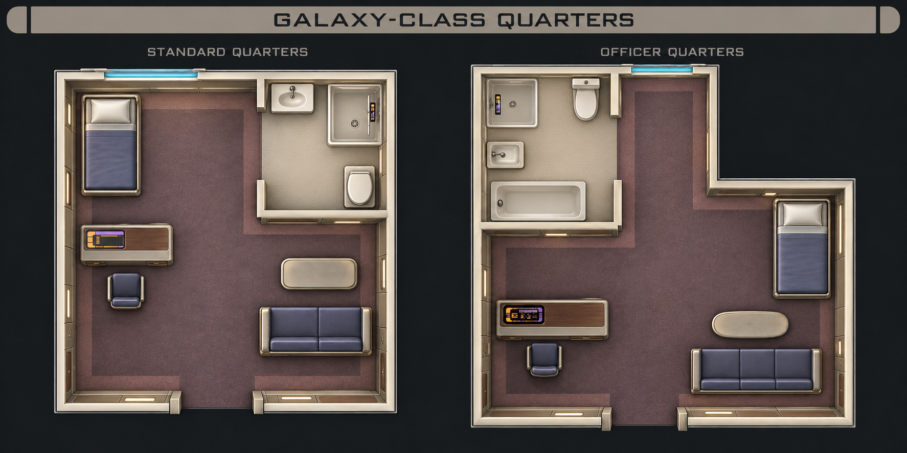
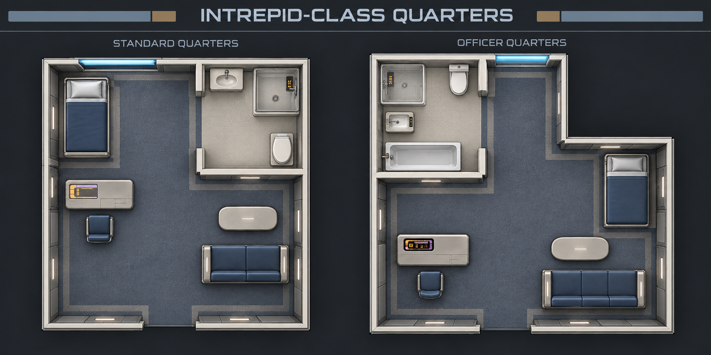

# Matching Galaxy and Intrepid cabins

**Geometry superseded:** use the [six approved measured plans](../../../../docs/interior-prefabs/cabin-revisions/README.md) for production, including rectangular officer/family suites with private master closets. These earlier boards remain material references only. The [first production candidates](../production/README.md) are now saved with fit-review results.

The user approved the corridor studies and requested matching cabin treatments. These two new review boards carry the same material choices into **standard quarters and L-shaped officer quarters**. They are saved design studies, not replacements in the live puzzle library.

**Galaxy class:** warm taupe/ivory fitted panels, mauve carpet with restrained border bands, rounded upholstery, wood-toned desk/storage accents, warm indirect light and amber/lavender LCARS.

**Intrepid class:** cool light-grey fitted panels, graphite trim, slate-blue carpet with lighter perimeter bands, chamfered furniture edges, neutral-white inset lights and amber LCARS.

## Preserve the room program

Both source rooms were supplied as geometry references to the built-in image tool. The corresponding approved corridor board was supplied only as a material/style reference. The studies retain the familiar furniture arrangement, hull-side windows, lower entrance and perimeter-attached bathroom. Standard accommodation includes a basin, toilet and sonic shower; the officer bathroom includes a separate tub as well. The officer room remains genuinely L-shaped.

The two boards were visually inspected as style studies. They are not a measurement or clearance certificate: wall thickness, opening widths and relative room scale still drift in the generated presentation. The production masters must be registered individually against the revised guides, not cropped or stretched from these boards. In particular, include the new storage, follow the corrected toilet directions and remove any modern plumbing details from the sonic-shower enclosure when producing the final assets.

## Production constraints

- Use Q01-B as the optional square cabin and Q02-R as the new rectangular standard. Both include fitted wardrobes and perimeter bathrooms.
- Use Q03-R for the long rectangular officer suite, Q05-F2/F3 for two/three-bedroom family suites, and Q04-P for paired junior-officer cabins. The L-shaped officer geometry is retired; retain only its style references.
- Preserve fixture scale and standing/walking access. Do not enlarge furniture or turn either bathroom into an isolated inner box.
- Follow the revised continuous bathroom/closet walls and recessed food-replicator positions. Each private cabin needs its own replicator within the marked thick service wall, with clear standing space in front.
- Keep the main and bathroom doorways clear of baked-in leaves; Foundry's native doors remain separate.
- Generate six individually registered cabin masters per style: twelve new cabin images, alongside the 14 planned corridor/access masters.
- Match each cabin's threshold, wall treatment and lighting to its selected corridor style. Cabin floors retain domestic zoning rather than copying a corridor runner through the furniture.
- Style selection changes materials, not footprint or connector geometry. Keep the existing source art and recipes available.

The combined next production batch is therefore **26 masters** (14 corridor/access, twelve cabin), plus the previously planned hatch states and compatible floor treatments. This expands the art brief; it does not change the implemented layout generator or existing world scenes.

Both boards were generated with the built-in `image_gen` tool, copied unchanged into this directory, and inspected. The full prompts and input references are saved in [prompts.json](prompts.json). No CLI/API fallback or local raster retouching was used.

See the [approved corridor direction and measured alcove](../corridor-studies/README.md) and [existing geometry masters](../../../../docs/interior-prefabs/starter-kit.json).
