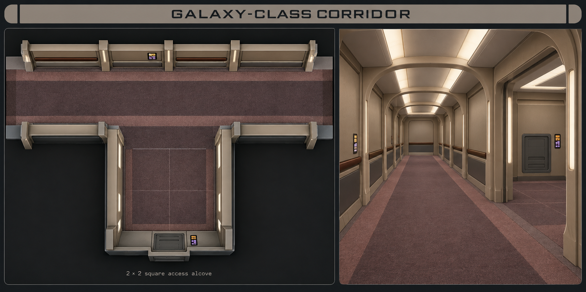
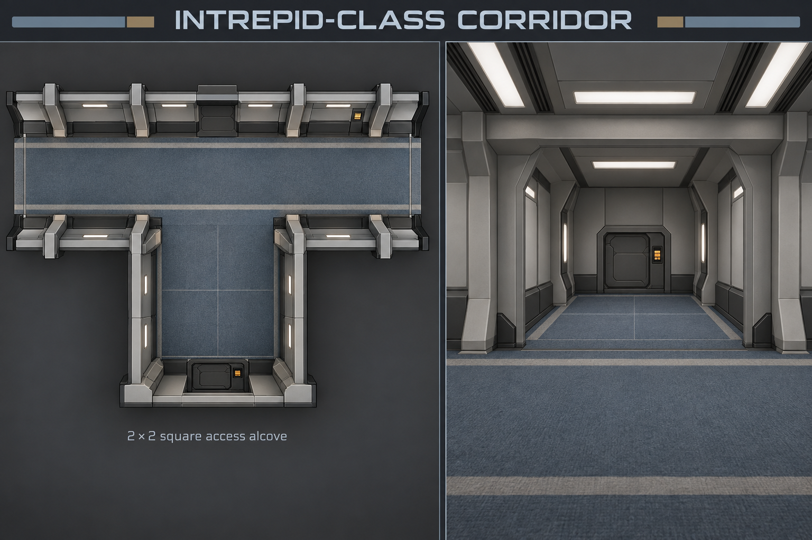
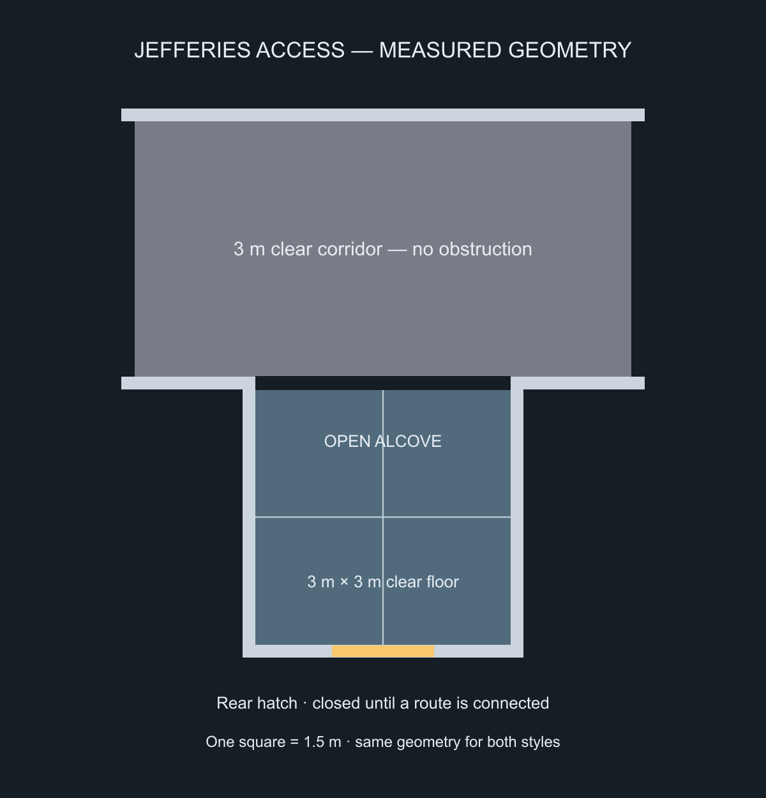

# Galaxy and Intrepid corridor direction

Both styles are retained as separate future selections, following the user's preference. These are **style studies and a measured alcove prototype**, not new runtime corridor tiles. Existing maps and their artwork are unchanged.

The user has approved both corridor looks and the [six revised cabin layouts](../../../../docs/interior-prefabs/cabin-revisions/README.md). The [production batch](../production/README.md) now tracks twelve cabin masters and fourteen corridor/access masters across both styles. The earlier L-shaped officer study is superseded by rectangular suites.

## Visual studies

Galaxy direction: warm taupe molded wall panels, dusty mauve carpet with a darker runner and border, rounded profiles, restrained dark wood-toned handrails, soft wall lighting and small LCARS controls.

Intrepid direction: cool grey wall panels, graphite bases, slate carpet with narrow pale edge bands, more angular ribs, inset neutral-white lamps and amber controls.

These are original genre-inspired visual interpretations, not surveyed replicas of named sets. The boards communicate materials and wall treatments. Their overhead panels contain perspective and their depicted dimensions are not reliable for map registration. The extra opposite-wall door in the Intrepid study is not part of the measured master. Final assets must use a true overhead camera, preserve their guide dimensions and omit unsupported openings.

## Jefferies access alcove

- Exactly **2 × 2 squares of clear standing floor**: 3 × 3 m at the project's 1.5 m grid scale.
- Located on the corridor's inboard side, outside its 3 m clear main walkway.
- Full-width open mouth; no room door between the passage and alcove.
- Recessed access hatch on the rear wall, with its release control beside it.
- Ribs, hatch surround and controls remain in the wall band and do not consume the clear floor.
- No lift cabin or lobby, and no furniture in the recess.

The 2.1 × 2.1-square outer footprint leaves exactly 2 × 2 squares between the inner wall faces. A new **H10-J** corridor master provides a 2-square alcove connection; **J01-A** joins to it. A straight spacer between cabin bays provides space without competing with the lift. The rear hatch is a closed visual access feature until a real service route or vertical destination is connected; it must not become a door into empty space.

The machine-readable geometry and production constraints are in [corridor-style-spec.json](../../../../docs/interior-prefabs/corridor-style-spec.json). `node --experimental-vm-modules tests/interior-prefab-alcove.mjs --render` verifies 160 placements across 2–6-cabin straight/bent layouts, exact clear dimensions, connectivity, non-overlap, inboard placement and an unobstructed alcove mouth. It writes the SVG guide; the PNG is a render of that code-native diagram.

## Next production batch

Once the visual direction is settled, create the same seven masters in each style (14 master images): straight, single room opening, opposed room openings, bend, end cap, alcove connector and 2×2 access alcove. Add one hatch state set and one compatible floor treatment per style. Room entrance doors continue using native Foundry animations.

The current shared-carpet overlay must be replaced with a style-specific floor treatment; otherwise it will erase the newly rendered runners and borders. The generator will need `Galaxy class` and `Intrepid class` choices, optional alcove placement, art registrations and revision hashes, while retaining compatible port geometry. No style selector or alcove has been enabled in the live generator in this design pass. The full Jefferies network remains a separate connected-route task.

## Provenance

Both boards were generated with the built-in `image_gen` tool and copied unchanged into this project. The full prompts are in [prompts.json](prompts.json). No API/CLI fallback or local raster retouching was used.

Reference context: [Roddenberry Archive — Enterprise-D interiors](https://roddenberry.x.io/2364-uss-enterprise-ncc-1701-d/) and [StarTrek.com — Jaunts Through the Jefferies Tubes](https://www.startrek.com/news/jaunts-through-the-jefferies-tubes). These inform the setting; the palette and map-production choices above are this project's art direction.
