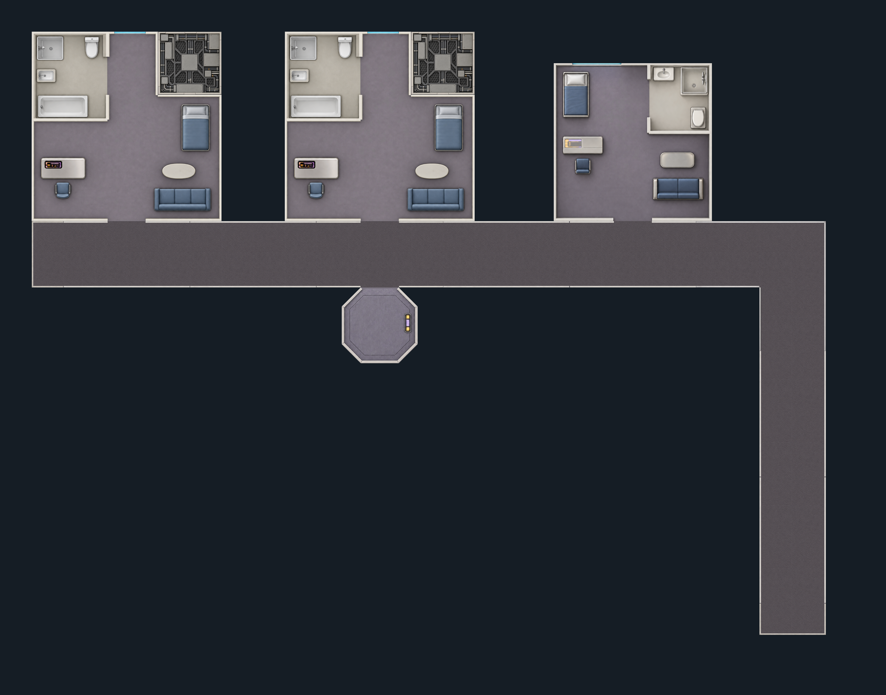
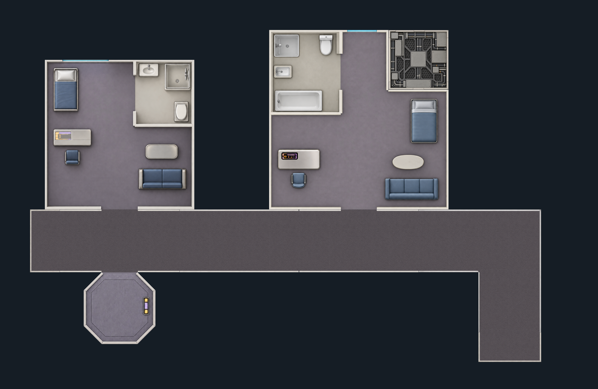

# Starfleet TNG prefab art candidates

Open [the artwork review](index.html) for all nine selected images and the corrected starter. The door button switches between open and closed doors; the outline toggle compares individual generated images with the fixed guides. **Scenes → Assembled Interior** now supports automatic habitation layouts as well as the original starter. This is the initial corridor-and-cabin family, not the complete ship/station library.

## Automatic habitation assembly

Reload Foundry and choose **Scenes → Assembled Interior → Automatic assembly**. Choose 2–6 cabins, standard/officer/mixed accommodation, a straight passage or inboard bend, outer-hull orientation and grid resolution. **New layout** changes the seed. The same seed and choices reproduce the geometry; mixed accommodation always includes both cabin types.

The assembler matches connector type, position and opposite direction, inserts passage spacers to clear cabin footprints, fills each suite's structural notch, adds one compact inboard lift, and caps both corridor ends. It rejects overlaps, disconnected walkable pieces, unmatched ports and windows facing other pieces. Every cabin retains its complete perimeter bathroom. Whole-scene rotations preserve physical scale, and Foundry 14+ keeps native double sliding doors. Piece placements, revisions and source image hashes are saved with the scene recipe.

Artwork is composed from the fitted original PNGs with uniform scaling and exact footprint clips. Corridors share the same continuous, wall-masked floor treatment as the starter. Generated image dimensions are capped at 8192 pixels while the scene's physical/grid dimensions remain unchanged. No additional artwork was generated for this step.

This version assembles a linear habitation section along one outboard side, with an optional inward corridor tail. It does not yet produce branching networks, loops, radial/curved hulls, Jefferies routes, other departments or other factions. Unoccupied areas between modules are outside this section's walkable floor; this is not a filled whole-deck plan.

Runtime geometry, connections and art registration are packaged in [assembly-library.json](assembly-library.json). Rebuild with `node tools/build-interior-prefab-library.mjs`. `node --experimental-vm-modules tests/interior-prefab-puzzle.mjs` checks 360 deterministic layouts, ports, connectivity, concave overlaps, hull/lift placement, source hashes and 24 export variants. Add `--render` to save example SVG compositions; render those with an SVG renderer to refresh the PNG examples. Static straight/rotated and bent examples were visually inspected. The user confirmed the earlier native-door fix works in Foundry; the automatic assembly dialog/export still needs live confirmation.

Macro API: `game.sta2eToolkit.generatePrefabLayout(recipe)` returns geometry; `game.sta2eToolkit.createAssembledInteriorScene(recipe, options)` renders and saves a new scene. Recipes accept `seed`, `cabins`, `mix`, `shape`, `rotation`, and `gridSize`. The existing `createPrefabInteriorScene` API retains its fixed-starter behavior.

[Open-door map](registered-assembly.png) · [Closed-door map](registered-assembly-closed.png) · [Separate door layer](registered-door-layer.svg)

| Piece | Selected artwork |
|---|---|
| Standard quarters, basin/toilet/sonic shower | [Q01-A-v2.png](Q01-A-v2.png) |
| L-shaped officer quarters, separate tub and sonic shower | [Q03-L-v2.png](Q03-L-v2.png) |
| Compact lift, direct corridor entry | [T01-A-v2.png](T01-A-v2.png) |
| Straight corridor | [H02-A-v3.png](H02-A-v3.png) |
| Single side doorway | [H08-A-v2.png](H08-A-v2.png) |
| Opposed side doorways | [H09-A-v2.png](H09-A-v2.png) |
| L-shaped corridor bend | [H04-A-v2.png](H04-A-v2.png) |
| Corridor end cap | [H07-A-v2.png](H07-A-v2.png) |
| Sealed structural infill | [F01-A-v1.png](F01-A-v1.png) |

Generated with the built-in `image_gen` tool on 2026-09-21 and corrected on 2026-09-22. [prompts.json](prompts.json) records the twelve original requests; [correction-prompts.json](correction-prompts.json) records five follow-up requests. Nine selected outputs and eight superseded images are preserved without local raster edits. The originals were copied from the image tool's generated-images directory into this project. No API/CLI fallback was used.

[catalog.json](catalog.json) records the selected revisions and unresolved art issues. [fit-report.json](fit-report.json) records alpha and envelope measurements. Passing file/alpha checks does not certify seams, door alignment, furniture clearance, or Foundry walls. Full scope and next production work are documented in the [geometry proof](../../../../docs/interior-prefabs/README.md).

The corrected proof uses [recorded image anchors](registration-anchors.json), one uniform scale per image, and exact polygon clipping during scene rendering. A plain floor underlay fills transparent edge holes. One world-aligned carpet texture, from the existing `floor-room-carpet.png`, is drawn across the corridor walking surfaces through a wall-aware mask; this removes floor-color seams and preserves the planned clear width. Source PNGs remain unchanged. This is a layered scene composition, not a claim that the individual PNG edges are seamless by themselves.

The five proof doors form a separate layer matching the deduplicated wall geometry. The open state contains no leaves. Door positions and widths are tested under all four quarter-turn rotations. Source hashes pin each registration to the selected PNG. Maximum measured anchor residual is 5.9 cm; the 7.5 cm regression threshold is a fitting-proof tolerance, not production clearance approval. Room wall thickness, furniture clearances, final door art, glazing separation and live Foundry export remain to be validated.

Rebuild with `node tools/build-interior-prefab-registered-proof.mjs`, then render the SVG deck proofs to PNG using an SVG renderer. Check with `node tests/interior-prefab-registration.mjs`. The uncorrected assembly remains in the review as a comparison. Static open/closed PNGs were visually inspected. All HTML sources are local; no external services or libraries are loaded. Browser rendering was not verified because the in-app browser previously blocked the local file URL.

## Experimental Foundry starter — 25 September 2026

Reload Foundry after updating the module, open **Scenes → Assembled Interior**, choose the outer hull side and resolution, and select **Create Starter Scene**. The fitted map includes both furnished cabins and perimeter bathrooms, the inboard lift, ten piece placements, 69 native wall segments (including five doors and two hull windows), and ten lights. Four quarter-turn orientations and 70/100/140-pixel grids retain the same physical scale. The preview has open doors; the created scene starts with closed doors.

The background is copied into the world's `sta2e-interiors` folder. Foundry 14+ uses native **Slide / Double Door** animations with [door-panel.svg](door-panel.svg), 750 ms duration and full retraction. Panels attach to the wall endpoints, including after wall edits. A native texture-grid scale of 200 keeps their thickness at 0.1 square. Foundry 13 retains separate, locked [door-leaf.svg](door-leaf.svg) tiles and the module's state-visibility hook. Scene creation opens the new scene for the GM without activating it for players.

Existing starter scenes upgrade when the active GM reloads Foundry and views the scene in version 14+. The upgrade only touches flagged starter doors, preserves wall positions, open/locked state and existing configured animation textures, and hides the old generated door tiles for recovery. This fixes the previous v14 half-width offset caused by using top-left coordinates with centered tile anchors. No scene regeneration is required.

[starter-scene.json](starter-scene.json) is the runtime manifest. It pins the open-door map by SHA-256 and includes deduplicated geometry with window intervals split out of opaque walls. Rebuild it with `node tools/build-interior-prefab-starter.mjs` after regenerating and rendering the proof. Runtime loading does not require `docs/` or `tools/`. The saved scene flag records the kit version, orientation, resolution and art hash.

`node --experimental-vm-modules tests/interior-prefab-scene.mjs` checks all 24 orientation/resolution/Foundry-generation combinations, image transforms, window clearance, door states and creation failure paths. These are offline adapter tests for generations 13 and 14, not live Foundry validation. The local Foundry port was unavailable on 25 September. Live creation, token movement, player vision, door refresh after reload and the dialog still need testing. The starter remains a fixed example; automatic piece assembly, curved hulls, Jefferies routes and other visual families remain future work.

The subsequent door fix also passes `tests/interior-prefab-native-doors.mjs <Foundry resources/app directory>` with `--experimental-vm-modules`: it runs the installed v14 `DoorMesh` implementation against 60 doorway/orientation/resolution combinations, checking both closed halves and fully retracted positions. Upgrade tests cover idempotence, retained locks/open states, custom animations, permissions and failed wall writes. This exercises native positioning/animation calculations with a mock rendering surface; it does not replace a live visual check. Foundry was reachable during the door fix, but the test browser stopped at the login screen.
