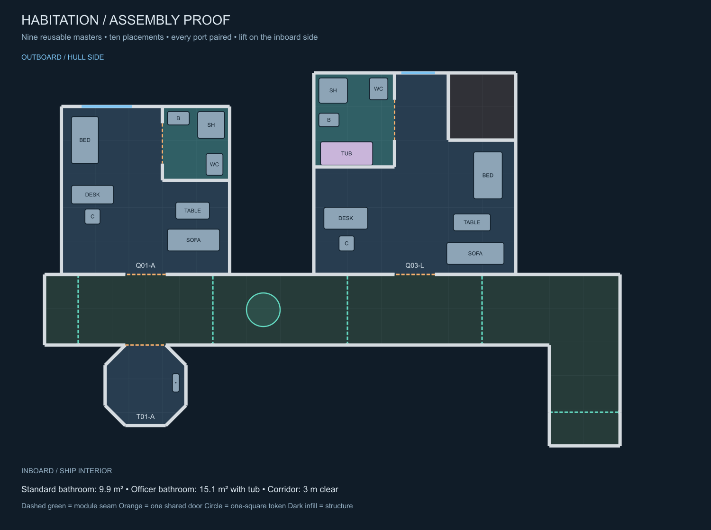

# Starfleet TNG starter geometry proof

This is the first assembly mockup for the approved [puzzle-kit production plan](../interior-prefab-production-plan.md). It establishes exact footprints and connections before finished room images are generated. It is not yet a selectable mode in the Foundry generator.

[All nine footprint templates](starter-footprints.png) · [Editable geometry catalog](starter-kit.json) · [Assembly SVG](starter-assembly.svg) · [Footprint SVG](starter-footprints.svg)

## What is established

| Template | Physical layout |
|---|---|
| Q01-A standard quarters | 7.5 × 7.5 m envelope; bed, desk, seating and a perimeter bathroom with basin, toilet and sonic shower |
| Q03-L officer quarters | 9 × 9 m envelope with a real 3 × 3 m missing corner; separate tub and sonic shower; the bathroom shares the outer walls |
| T01-A compact lift | 3.6 × 3.6 m faceted cabin envelope, one direct corridor doorway, inboard only |
| H02-A straight | 6 m run; 3 m clear passage |
| H08-A side-door corridor | Same run and width, with one fixed room opening |
| H09-A opposed-door corridor | Same run and width, with two opposite room openings |
| H04-A bend | L-shaped floor with two compatible corridor ends |
| H07-A end cap | Rotates to close an unused passage end |
| F01-A structural infill | Fills the officer cabin's notch; solid technical space, not an inaccessible room |

There are ten placements made from nine masters: the end cap is reused with a different rotation. All eight module connections pair exactly. The three external room doors and two bathroom doors are represented once each in the merged wall data.

The bathroom envelopes are **9.9 m²** and **15.1 m²**, measured to wall centre lines. Net clear floor area is slightly smaller. Fixtures are represented at physical scale. Walking checks account for furniture and solid walls and verify that a one-square / 1.5 m diameter token can travel between the declared entrance, bathroom and living-area approach points with doors open. These checks do not claim that every furniture fixture itself is walkable.

Corridor walls are 0.15 m thick. A 3.15 m wall-centre span leaves 3 m clear between their inner faces. This distinction is intentional: wall thickness must not silently reduce the agreed passage width. Ordinary door openings are 1.8 m clear. Door positions are fixed per master.

The proof is a short connection example, not a complete ship deck. Empty space between separate modules is not automatically a finished hull or a corridor. The larger kit still needs the planned utility infill, hull caps, radial modules, Jefferies pieces and additional room types.

## Art direction for the first finished set

The diagram colours identify rooms, bathrooms, corridors and structural fill; they are **not** the final room colours.

| Surface/detail | Proposed TNG-set treatment |
|---|---|
| Camera and scale | Exact overhead orthographic; fixed physical footprint; no perspective walls or stretched furniture |
| Room floor | Muted warm grey/lavender carpet with fine restrained texture |
| Corridor floor | Coordinated charcoal carpet; repeated seams and guidance trim at the agreed pitch |
| Bathroom | Warm neutral, slightly cooler non-slip floor; built-in basin, sonic shower, toilet, and suite tub |
| Walls and frames | Pearl/warm-grey wall tops, darker recessed trim, consistent cut height and cross-section |
| Furniture | Slate-blue upholstery, light neutral beds/storage, brushed-metal fittings |
| Controls | Restrained amber/lavender/blue interface details; no readable text baked into the master |
| Illumination | Even neutral overhead lighting and subtle contact shadows; no strong shadow falling across a connection seam |
| Doorways | Frame and sill in the master; a separately controlled leaf/state layer at each shared opening |
| Windows | Declared exterior edge only; glazing supplied as a layer; no permanent exterior starfield baked into a room |

The existing furnishings and room inserts may inform materials and composition. They are not geometry substitutes. Each final render must match the template footprint, doorway location and fixture arrangement, with transparent pixels outside its envelope.

## Verification and scope

Run `node tests/interior-prefab-proof.mjs`. Add `--render` to regenerate the SVG proof sheets and prototype merged-wall JSON from the catalog. PNGs are rendered from those SVGs for convenient viewing.

Checks cover unique piece IDs, ports fitting their boundaries, matching port types/positions/directions, declared fixture containment, perimeter-attached bathrooms, expected tub variants, one-square-token access, assembly connectivity, footprint overlaps at 0.1-square sampling, inboard/outboard placement, rotation consistency, and deduplicated door segments. The assembly was also visually inspected.

`starter-assembly-walls.json` records geometry in grid units for this proof; it is **not** a Foundry scene import. No existing world scenes, current generator mode, or room artwork were replaced. Native Foundry wall, window and lighting export will be validated when this catalog is integrated.

Next production step: complete the clean art-guide/mask exports and render the first fixed-template room/corridor set, then verify the finished-art seams and native door states. Curved hull and Jefferies compatibility require their own geometry proofs before those pieces enter production.
