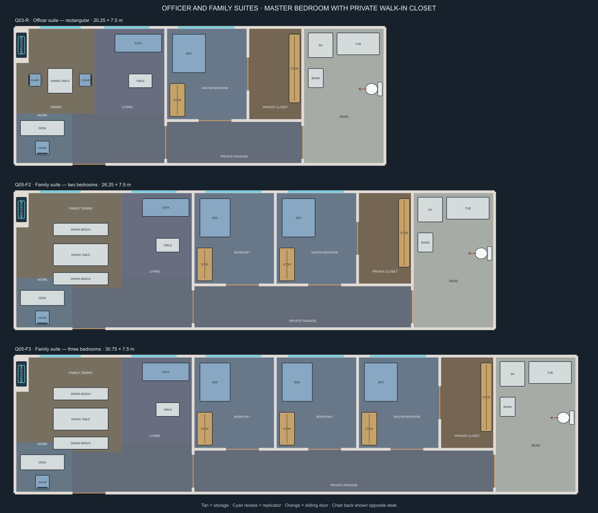

# Revised cabin geometry

**Procedural integration (version 6):** These six measured plans are now selectable through **Generate Interior → Cabin arrangement → SVG** choices. The procedural path reuses the catalog's exact dimensions, partitions, entrances, closets, fixture envelopes and replicator service walls; no finished room art is required. See the [runtime cabin review](../../interior-previews/measured-cabin-layouts.html) and [procedural documentation](../../procedural-interiors.md). Statements below about pending runtime assembly refer to the separate image-prefab pipeline, whose pinned artwork catalog remains unchanged.

**Layouts approved for production.** The user accepted these layouts and deferred additional variants. The next artwork batch now uses [rooms with attached corridor halves](../room-corridor-halves/README.md). These room interiors stay unchanged; the combined guides add the corridor floor outside their entrance wall. Earlier room-only candidates are appearance references.

These measured plans supersede the cabin geometry brief for the next Galaxy and Intrepid artwork batch. They address missing clothing storage, connected closet partitions, recessed food replicators, toilet orientation, rectangular proportions and paired junior-officer accommodation. They are design guides, not installed scene artwork; the existing runtime catalog remains pinned to its registered images.

The L-shaped officer design is retired from this production catalog. Q03-R replaces it with a long rectangle; Q05-F2 and Q05-F3 extend that arrangement for families with two or three private bedrooms. Dining and living areas have separate floor zones, the desk has a dedicated work area, and the chair faces the desk from its working edge. A private passage reaches every bedroom and the shared head. The master bedroom has its own private walk-in closet, entered directly from the bedroom. Family dining benches provide six places.

| Master | Envelope | Accommodation |
|---|---|---|
| Q01-B | 7.5 × 7.5 m | Optional square cabin; fitted wardrobe; perimeter bathroom with toilet, basin and sonic shower |
| Q02-R | 6 × 9 m | Default shape for new standard cabins; fitted wardrobe; perimeter bathroom with toilet, basin and sonic shower |
| Q03-R | 20.25 × 7.5 m | Rectangular officer suite; dining, living/work, a master bedroom with private walk-in closet, and a head with tub and sonic shower |
| Q04-P | 18 × 6 m overall | Two 7.5 × 6 m private cabins at opposite ends of a 3 × 6 m shared bathroom; each has a wardrobe, desk, bed and its own corridor entrance |
| Q05-F2 | 26.25 × 7.5 m | Two-bedroom family suite; shared dining/living/work areas, bedroom wardrobes, a master bedroom with private walk-in closet, and a shared head |
| Q05-F3 | 30.75 × 7.5 m | Three-bedroom family suite with the same shared facilities and independent bedroom entrances |

Dimensions are wall-centre envelopes, not net floor measurements. One layout unit is 1.5 m; ordinary partitions are 0.15 m thick and ordinary door openings are 1.8 m. Replicator service walls extend 0.75 m inward from their structural wall centre lines, reserving space for the recessed appliance and its services without moving the puzzle boundary. These are proposed game-map dimensions, not canonical ship specifications.

Suite bedrooms have 4.5 × 5.1 m envelopes. The 3 × 5.1 m walk-in closet belongs to the adjacent master bedroom. Its doorway opens directly into that bedroom; its former passage entrance is now a solid wall. Hanging storage occupies the far wall to keep the new doorway clear. The master has a 1.8 m-wide bed. The shared head remains accessible from the passage, independently of the master. All partition endpoints join other walls, with no narrow gaps or detached closet boxes. These are larger footprints than the retired L-shaped master; they need new placement spacing rather than substitution into an old room bay.

Every cabin or household suite has a food replicator recessed into a thick service wall: seven appliances across six plans. The paired junior cabins each have their own appliance; family suites share one in their dining area. Cyan-outlined recesses mark the exact placement; clear standing approaches are recorded in the catalog. Furniture was repositioned where necessary to retain walking access. The service-wall solids are planning data and will need to be included in runtime collision/export when these guides are integrated.

The supplied Nova-class senior, guest and captain's quarters references inform the joined partitions, built-in fittings and grouping of service spaces. Their images are visual references, not imported artwork or a claim that these guides reproduce their dimensions. The paired junior option remains available. Old Q03-L2 guide files and the original runtime Q03-L are historical only; neither is a current artwork target.

Toilet symbols explicitly show the cistern against the wall and the bowl facing usable floor. The arrow marks the bowl/front direction. Bathrooms share perimeter walls; none is a detached box within the living space. The paired bathroom has one private sliding door from each cabin. Both should be lockable for privacy; no automatic privacy interlock is implemented by these guides.

## Artwork requirements

Apply the [cabin style guide](../cabin-style-guide.md) before generation. Material and furniture variants must fit these approved fixture envelopes; new decoration requires reserved clear space.

- Produce all six combined room/half-corridor masters in both approved material families. Alongside the Jefferies module this makes 14 primary artwork targets, with support pieces tracked separately in the new production inventory.
- Preserve these footprints, windows, partitions, fixture positions and wardrobe/closet access. Do not stretch the earlier square cabin art into the rectangular footprint.
- Build food-replicator recesses into the marked thick service walls, facing their recorded standing areas. Do not depict the appliances as freestanding cabinets or put them across a doorway/window. Keep the officer bathroom/closet wall continuous.
- Use the older cabin boards for palette and furniture treatment only. Their missing storage and old geometry are superseded.
- Keep moving door leaves separate from the room image for native Foundry animation.
- The paired module has two corridor ports eight layout units apart. Its two-door placement, counting as two cabins, still needs runtime assembly support and validation before release.
- The rectangular officer and family suites require wider hull frontage, bedroom partitions and larger reserved room bays. Retire the L-shaped option from future selection when these replacements are registered and integrated; preserve existing saved scene recipes.
- Register and validate the new images before changing the live catalog. Existing scene recipes retain their original geometry.

## Files and verification

[Editable catalog](catalog.json) · [All six plans](cabin-revisions.png) · [Suite SVG](suite-revisions.svg) · Individual plans: [square](Q01-B-guide.png), [rectangle](Q02-R-guide.png), [officer suite](Q03-R-guide.png), [junior pair](Q04-P-guide.png), [two-bedroom family](Q05-F2-guide.png), [three-bedroom family](Q05-F3-guide.png).

Regenerate the catalog and SVG guides with `node tools/build-interior-cabin-revisions.mjs`. The builder is the source of these revisions; it reads the legacy catalog without modifying it.

Run `node --experimental-vm-modules tests/interior-cabin-revisions.mjs`. Checks pass for rectangular suite footprints, one/two/three private bedrooms, desk-chair alignment and approach, independent bedroom/head access, direct master-to-closet access and closet privacy, connected walls, recessed appliances, fixture non-overlap, toilet orientation and storage approaches. Walking checks use a 1.5 m diameter token, furniture and service-wall obstacles, and wall thickness with doors open. The suite sheet was also visually inspected. These checks do not yet certify new artwork, assembled seams or a live Foundry scene.
