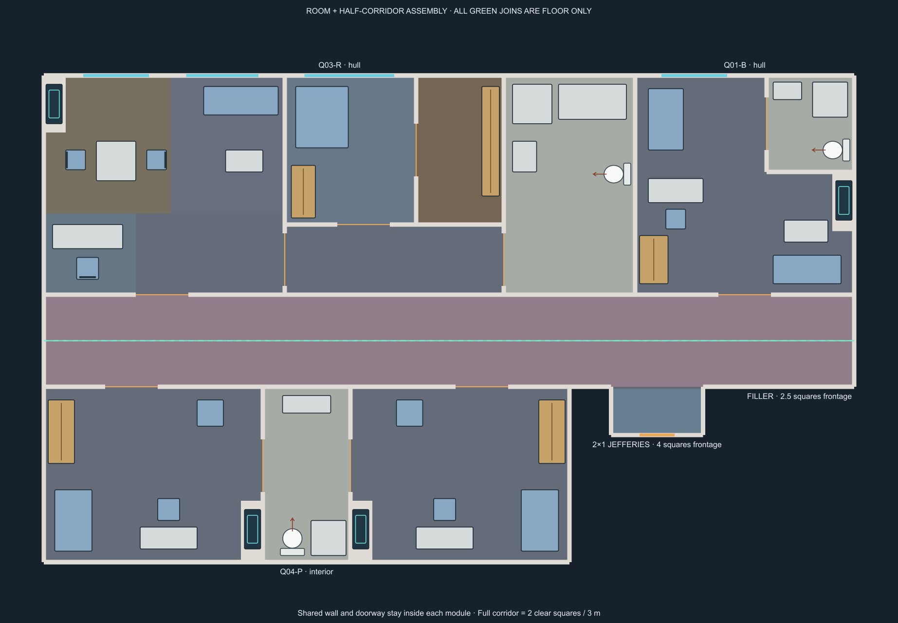

# Rooms with attached corridor halves

This is the approved architecture for the next Galaxy and Intrepid artwork batch. Each room owns its corridor-facing wall, doorway and one clear square of corridor floor. The two banks meet on floor at the corridor centre line. The six approved cabin interiors are unchanged.

The proof joins an officer suite and compact cabin on the outer hull opposite interior junior quarters, a Jefferies alcove and an explicit filler. The hull cabins have windows; the interior pair has a solid rear wall. Equal-depth hull cabins form a continuous straight outer edge. Opposing rooms can have different widths: the assembler matches overlapping floor intervals instead of requiring equal-width pairs. Green marks the floor join, never a collision wall.

## Measured contract

- One square is 1.5 m. Two clear half floors make a 3 m corridor. With 0.1-square walls, each half extends 1.05 squares from its entrance wall centre to the floor seam.
- The full entrance wall and empty doorway belong to the combined image. Native animated door leaves remain separate. Door coordinates retain the approved room geometry.
- Floor joins export no walls or doors. One shared, narrow centre finish covers the centre join; individual masters must not paint duplicate centre runners.
- Blank halves fill unmatched frontage exactly. Adjacent room partitions are deduplicated into a single collision boundary.
- The inboard Jefferies module has a clear 2×1-square recess (3 × 1.5 m) and an open corridor mouth. Its rear hatch stays closed until a maintenance route or deck destination exists. The module retains four squares of frontage including its side shoulders; the standing recess is two squares wide.
- Corridor ends, bends and junctions own their full cross-section. End geometry is implemented; bend and junction geometry remain production tasks.

## Production inventory

Cabin image prompts and reviews must follow the [cabin style guide](../cabin-style-guide.md), including recorded furniture choices, sonic showers and the reusable base/rear-wall lighting rules.

Create six combined cabin bases and one combined Jefferies master in each style: 14 primary artwork targets. Cabin bases omit the rear-wall band. One registered solid or windowed rear-wall layer completes each cabin, so interior versions reuse the same furnishings. Each style also needs blank-half material, an end cap, a bend, a T junction, a centre finish, solid rear walls, windowed rear walls and curved hull sections. These sixteen support tasks are families of deliverables, not a fixed image count.

## Hull walls and curves

Only a cabin explicitly assigned to the exposed hull bank can use the windowed layer. The default cabin variant is interior and solid. The assembler rejects windowed cabins on an interior bank, and rejects different cabin depths along a straight hull row. Windows remain blocked for movement; their artwork and native window segments share coordinates.

A separate hull-wall image is the planned approach for shallow curves, but must follow measured geometry. A common hull curve should determine section endpoints, window positions, cabin placement and any tapered service spaces between bays. Preserve the approved furnishing scale and entrance clearances. Rotating rectangular cabins independently would break their attached corridor seams, so curved banks require compatible corridor geometry and adapters as well. A decorative curved line alone cannot replace the collision boundary. Curved profiles remain pending; the current proof uses straight registered wall layers.

Use the individual `*-HC-guide.svg` files and [catalog](catalog.json) as the geometry contract. The old room-only renders remain material references; none is a combined master. The [production manifest](../../../assets/interiors/prefabs/production/manifest.json) tracks the new targets separately.

## Implementation and checks

`scripts/interior-room-corridor-layout.js` assembles contiguous straight banks with explicit walls, interval joins and four quarter-turn orientations. It is a geometry implementation, not yet connected to the live Foundry generator. Combined artwork, full junction geometry, asset registration and Foundry export/interaction checks remain before release. Existing saved scenes retain their original geometry.

Rebuild source guides with `node tools/build-interior-cabin-revisions.mjs`, then `node tools/build-room-corridor-guides.mjs`. SVG is the editable output; render PNG previews with the project's Sharp runtime.

`node tests/interior-room-corridor-halves.mjs` checks 288 interior assemblies and 48 hull variants, including rotated solid/windowed wall layers, exposed-window rules, aligned hull depths, exact floor coverage, door deduplication and a one-square token fitting the shallow alcove. `node --experimental-vm-modules tests/interior-cabin-revisions.mjs` checks the underlying cabin plans.
